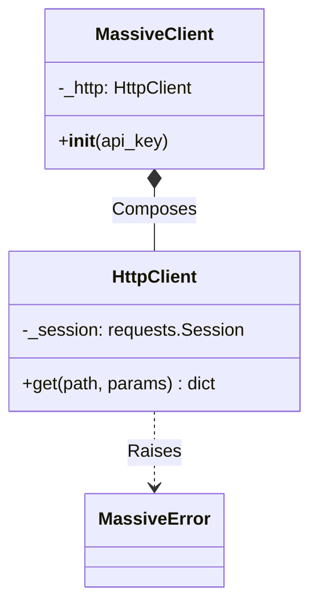
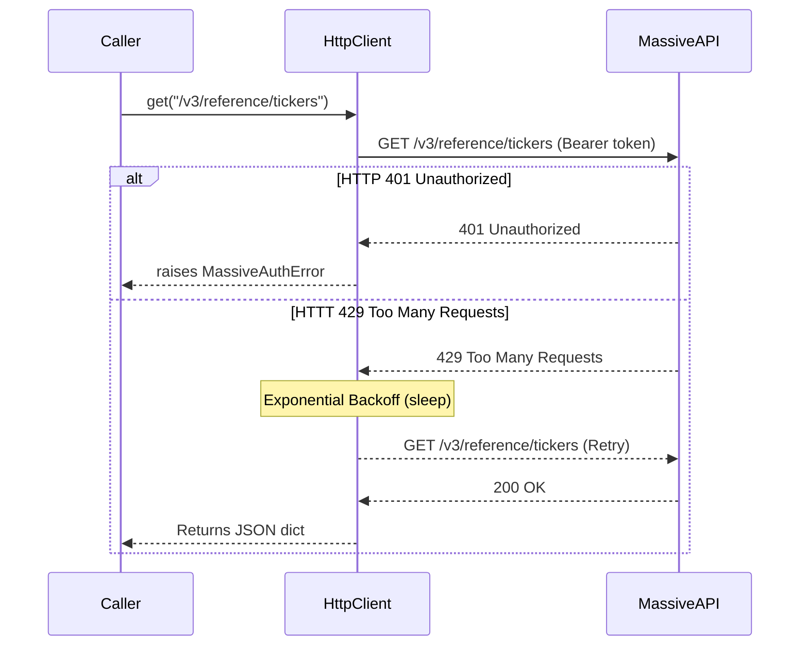

# Design: Massive Data Core Client

## 1. System Architecture
The Core module provides the foundational infrastructure for the Massive Data API client. It uses a bottom-up composition approach:
1. **Exceptions Layer (`errors.py`)**: Pure definitions of error states.
2. **Transport Layer (`http.py`)**: A resilient wrapper around `requests.Session` that handles auth injection and exponential backoff.
3. **Facade Layer (`client.py`)**: The public entry point for developers.

## 2. Class Definitions

### `errors.py`
```python
class MassiveError(Exception): pass
class MassiveAuthError(MassiveError): pass
class MassiveRateLimitError(MassiveError): pass
class MassiveTransportError(MassiveError): pass
```

### `http.py`
```python
class HttpClient:
    def __init__(self, api_key: str, base_url: str = "https://api.massive.com", timeout: float = 15.0): pass
    def get(self, path: str, params: dict = None) -> dict: pass
    # Internal retry logic using standard requests.Session
```

### `client.py`
```python
class MassiveClient:
    def __init__(self, api_key: str, timeout: float = 15.0):
        self._http = HttpClient(api_key, timeout=timeout)
```

## 3. Interaction Diagrams

### 3.1 Component Structure


### 3.2 Resilient Request Flow


## 4. Directory Structure
```text
src/trading_firm/clients/massive/core/
☜╠╠ __init__.py
☜╠╠ client.py
☜╠╠ errors.py
└╠╠ http.py

tests/clients/massive/core/
☜╠╠ __init__.py
☜╠╠ test_client.py
└╠╠ test_http.py
```
